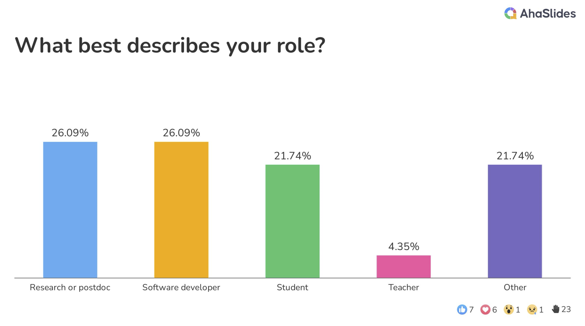
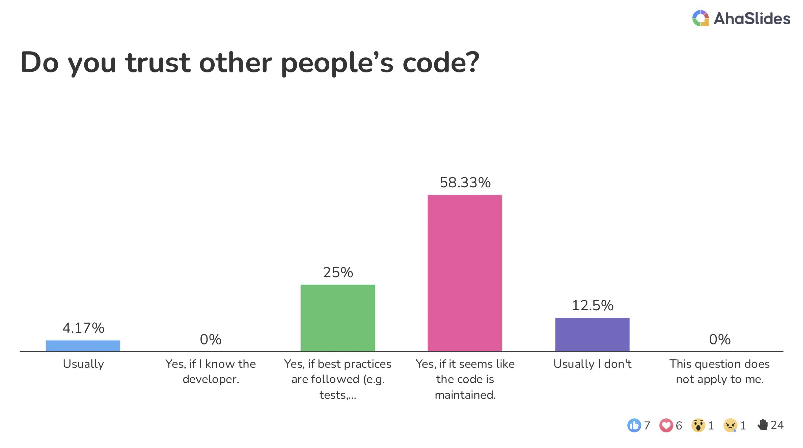

At the DH2023 conference in Graz, Austria, a group of digital humanities academics and professionals gathered for a [workshop titled  “How can you trust your code?” organized by DHTech](/dh2023-workshop/). The goal of the workshop was to identify and discuss issues related to the development, use, and reuse of research software in digital humanities and across humanities disciplines more broadly. We'll be posting content compiled from the notes and resources gathered during the many productive conversations during that one-day workshop as a series of related blog posts over the next few months, and once they are all published, we'll combine the content and publish it as a whitepaper authored by all workshop participants.

Our goal in writing up those conversations is to document the main issues affecting those who write research software for digital humanities and those who utilize them in their research endeavors, and where possible to make recommendations.

The workshop was attended by a wide range of participants in a variety of roles. Those present included faculty and graduate students involved in teaching and research, some of whom fall into the researcher-developer category, as well as people working in technical roles such as Research Software Engineers. 

The diversity of perspectives made it possible for a number of wide-ranging conversations, considering issues from a variety of disciplinary viewpoints (both computer science side and humanities) and practical goals (teaching, research, software engineering), identifying problems and proposing possible solutions. The range of expertise and perspectives present at the workshop was particularly valuable since Digital Humanities work requires numerous proficiencies, both technical and academic.

In a poll during the opening session, people generally said they trust other people's code if it seems to be maintained.

However, when we asked what measures people take to check if code is trustworthy, we got a range of responses from trying the code out, reading through it, checking what kind of tests are present, checking the quality of the documentation, talking to the maintainers, and even concern that there are no AI-generated snippets.

* * * 

As a group, we brainstormed and grouped the topics we thought were important to discuss, and held a number of different conversations in smaller breakout groups over the course of the day related to creation, use, reuse, and maintenance of software in the digital humanities. Towards the end of the day, we started the work to organize those conversations around these broad topics:

- Code quality
- Institutional and social structures
- Theoretical foundations of software development
- Documentation best practices
- Understanding AI and ‘black box’ tools and algorithms
